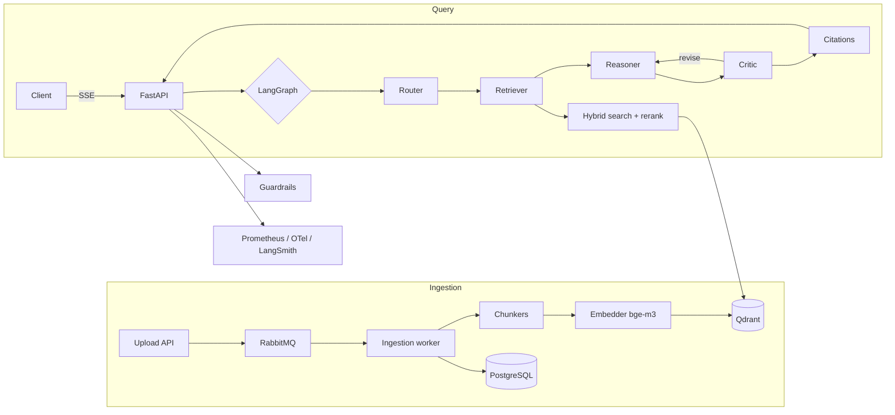

# enterprise-rag-platform

Multi-agent RAG platform for enterprise document search: hybrid retrieval (dense + BM25 + cross-encoder reranking), a LangGraph agent graph with self-correction, streaming SSE API, guardrails and full observability.


> Demo GIF placeholder

## Architecture



## Quickstart

```bash
git clone https://github.com/dataeclipse/enterprise-rag-platform
cd enterprise-rag-platform
cp .env.example .env
make up        # qdrant, postgres, redis, rabbitmq, prometheus, grafana
make dev       # uv sync with ml extras
uv run uvicorn rag.api.main:app --reload
```

## Status

Work in progress. Module-by-module build; see commit history.

## Design Decisions

See [docs/adr](docs/adr) for full records.

## License

MIT
