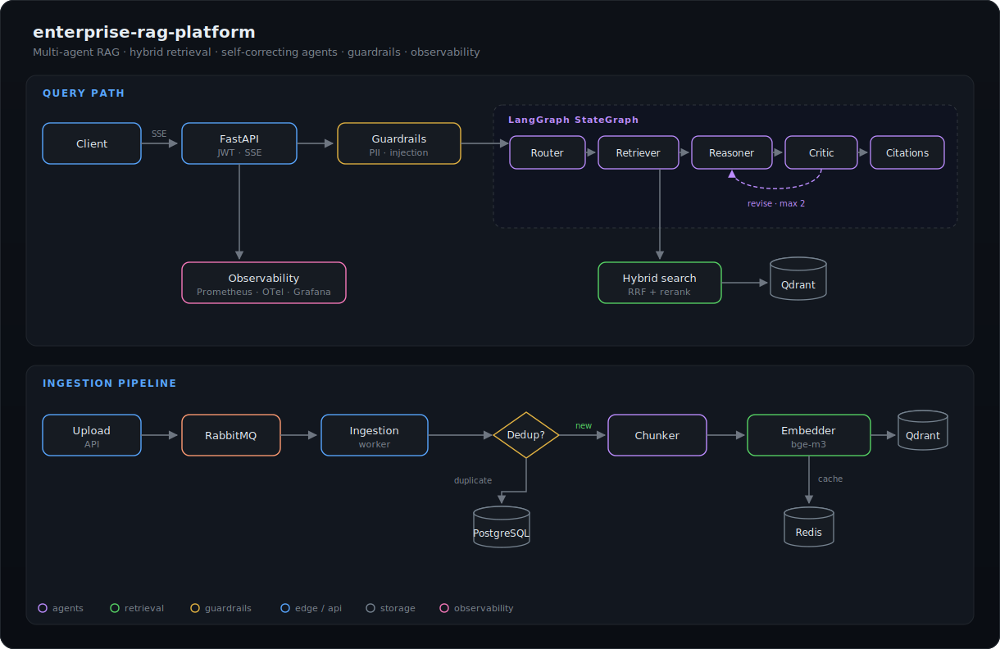

# enterprise-rag-platform

Multi-agent RAG platform for enterprise document search: hybrid retrieval (dense + BM25 + cross-encoder reranking), a LangGraph agent pipeline with bounded self-correction, streaming SSE API, deterministic guardrails and full observability.


## Architecture

<p align="center">
  
</p>

## Features

- **Ingestion pipeline** - PDF / DOCX / Markdown / HTML loaders, recursive and semantic chunking, bge-m3 embeddings with Redis cache, SHA-256 + MinHash deduplication, document versioning with supersede semantics, async processing through RabbitMQ.
- **Hybrid retrieval** - dense (Qdrant) + sparse (BM25) fused with Reciprocal Rank Fusion, optional bge-reranker-v2-m3 cross-encoder. Vector store behind a Strategy abstraction (Qdrant / in-memory shipped, pgvector / Chroma / Pinecone pluggable).
- **Multi-agent graph** - router → retriever → reasoner → critic → citations on LangGraph. The critic checks groundedness and sends drafts back for revision, capped at 2 rounds. Out-of-scope queries short-circuit.
- **API** - FastAPI with JWT auth, `POST /query` (JSON) and `POST /query/stream` (SSE stage + answer events), multipart document upload, Prometheus `/metrics`.
- **Guardrails** - PII redaction (email, phone, credit card with Luhn, SSN, IBAN, IP) and weighted-rule prompt-injection detection, both deterministic and observable.
- **Observability** - structlog JSON logs with request IDs, Prometheus metrics, OpenTelemetry tracing, Grafana dashboard, optional LangSmith via env.

## Quickstart

```bash
git clone https://github.com/dataeclipse/enterprise-rag-platform
cd enterprise-rag-platform
cp .env.example .env          # set RAG_AUTH__SECRET_KEY
make up                       # qdrant, postgres, redis, rabbitmq, prometheus, grafana
make dev                      # uv sync --group dev --extra ml
uv run uvicorn rag.api.main:app --reload
```

Point `RAG_LLM__BASE_URL` at any OpenAI-compatible server (vLLM, Ollama, OpenAI). With Ollama: `ollama serve` + `ollama pull qwen3:8b` and the defaults work.

```bash
TOKEN=$(uv run python -m rag.api.token demo)
curl -X POST localhost:8000/documents \
  -H "Authorization: Bearer $TOKEN" \
  -F "file=@evals/dataset/corpus/hr-handbook.md"
curl -X POST localhost:8000/query \
  -H "Authorization: Bearer $TOKEN" -H "Content-Type: application/json" \
  -d '{"query": "How many vacation days do employees get?"}'
```

## Evaluation

Retrieval quality on the bundled golden dataset (15 questions, 19 chunks, `make eval`):

| Mode | Hit@1 | Hit@3 | MRR@5 |
|------|-------|-------|-------|
| BM25 only | 0.933 | 0.933 | 0.950 |
| Dense only (MiniLM-L6-v2) | 1.000 | 1.000 | 1.000 |
| Hybrid RRF | 1.000 | 1.000 | 1.000 |

Hybrid fusion recovers the keyword-mismatch query that BM25 misses while staying robust to vocabulary drift that hurts sparse-only setups. End-to-end RAGAS metrics (faithfulness, answer relevancy, context precision/recall) run against a live LLM with `make eval-ragas`.

## Development

```bash
make test           # unit tests with coverage (157 tests, 91% coverage, no services needed)
make test-integration  # requires docker compose stack
make lint           # ruff + black
make typecheck      # mypy --strict
```

CI runs lint → typecheck → tests → docker build on every push. Unit tests mock all external services; integration tests skip automatically when services are absent.

## Design Decisions

| ADR | Decision |
|-----|----------|
| [0001](docs/adr/0001-vector-database.md) | Qdrant behind a Strategy abstraction; in-memory adapter for tests |
| [0002](docs/adr/0002-hybrid-retrieval-rrf.md) | Rank-based RRF fusion instead of tuned weighted-sum |
| [0003](docs/adr/0003-multi-agent-graph.md) | LangGraph StateGraph with a bounded critic revision loop |
| [0004](docs/adr/0004-guardrails-heuristics.md) | Deterministic sub-millisecond guardrails before the agent graph |
| [0005](docs/adr/0005-ingestion-versioning-dedup.md) | SHA-256 + MinHash dedup, crash-safe version supersede |

## Project Structure

```
src/rag/
├── ingestion/      # loaders, chunkers, embedders, dedup, pipeline, queue, storage
├── retrieval/      # vector store adapters, BM25, RRF fusion, reranker
├── agents/         # LangGraph nodes, prompts, graph assembly
├── llm/            # OpenAI-compatible provider with retries and structured output
├── guardrails/     # PII redaction, injection detection
├── api/            # FastAPI app, auth, SSE, DI container
└── observability/  # structlog, Prometheus, OpenTelemetry
evals/              # golden dataset, retrieval metrics, RAGAS harness
k8s/                # Deployment, Service, HPA manifests
```

## Deployment

- `docker-compose.yml` - full local stack including Prometheus and Grafana (dashboard auto-provisioned at `localhost:3000`).
- `k8s/` - production manifests: 2-replica API deployment with probes and non-root security context, ingestion worker, HPA (CPU/memory, 2→8 replicas).

## License

MIT
